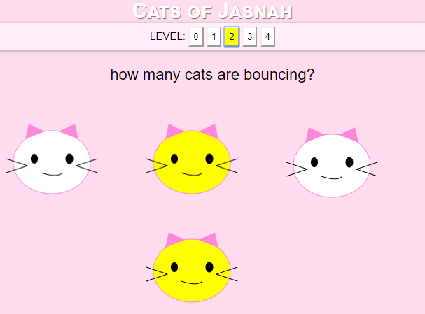

# cats-of-jasnah
Cats of Jasnah, a web based game for learning categories and logic

I made this game with my 3 year old to develop logical language skills. It progresses from counting up to increasingly difficult word problems using boolean logic. This seems like an effective path for her to learn at her current level of development and I couldn't find something like this elsewhere.

Enjoy!

[Play the game](https://countable.github.io/cats-of-jasnah)

### References

Thanks for all the feedback, folks from [Hacker News!](https://news.ycombinator.com/item?id=21880446#21886290)

[The Game of Logic, Lewis Carroll](https://www.gutenberg.org/files/4763/4763-h/4763-h.htm)
